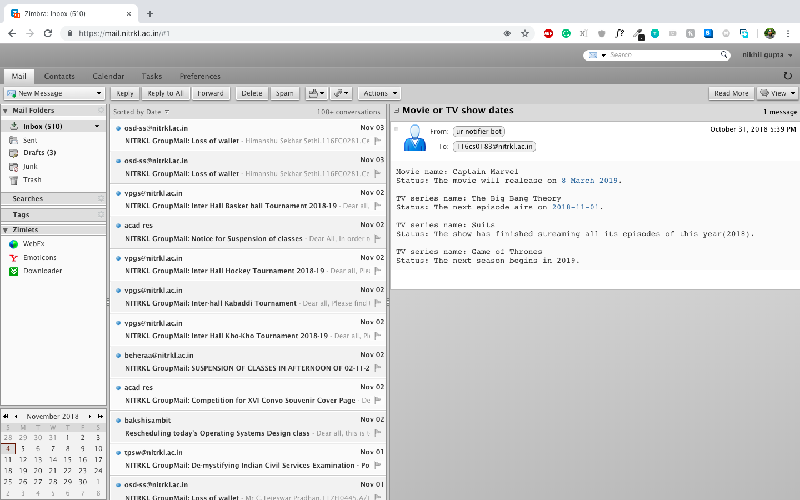

# Movie/TV Show notifier Script

Who doesn’t love to watch Game of Thrones or black mirror or keen to know the movie release date, right? We all love to
binge watch the newest TV Series or latest episodes of our favourite seasons all
over the weekend or on a lazy afternoon.
However, we are so engaged in our work that we don’t have time to keep track of
all our favourite seasons and their latest episodes’ air time. This leads to the worst
nightmare a series buff can have. 


This is when Movie/TV Show notifier Script becomes life savior. It's written in python 3. All you need is to run the script, provide your email address and list of Movie/TV Shows you want to get notified.

## Getting Started

First download the whole repository into your PC. Then all you need is to run the python program **script.py** , provide your email address and list of Movie/TV Shows you want to get notified.

### Prerequisites

First you should have [Python 3](https://docs.python.org/3.0/) installed in your PC. If it's not installed one can easily install it through following links:

* [Installing Python 3 on Mac OS X](https://docs.python-guide.org/starting/install3/osx/)
* [Installing Python 3 on Linux](https://docs.python-guide.org/starting/install3/linux/)
* [Installing Python 3 on Windows](https://docs.python-guide.org/starting/install3/win/)


### Installing

After installing python 3 we need to again install all the necessary dependencies in order to run the script.

It's always recommended to use [Virtual Environment(virtualenv)](https://packaging.python.org/guides/installing-using-pip-and-virtualenv/) before installing dependencies as virtualenv allows you to manage separate package installations for different projects. It essentially allows you to create a “virtual” isolated Python installation and install packages into that virtual installation. One can easily install, create and activate virtualenv by following the link mentioned below :

* [Virtual Environment(virtualenv)](https://packaging.python.org/guides/installing-using-pip-and-virtualenv/)

After that you can install 'requirements.txt' as it contains all the necessary dependencies you need to run the script. To install all the dependencies at once you just need to install pip and run the following command:

```
pip3 install requirements.txt
```

It can also be installed manually one by one by running the following commands:

```
pip install requests==2.18.4
```

```
pip install beautifulsoup4==4.6.3
```

**smtplib, sqlite3, email.mime.multipart, email.mime.multipart, email.mime.text** are other dependencies used in the script. Since these dependencies already come built-in with python you don't need to install it separately.
## Sample Input

Enter your Email address: abc.123@xyz.com  

Enter Movie or TV show separated by comma(,): Game of thrones, suits, friends, gotham

## Running the tests

After you enter the details just click Enter key and wait few seconds for the command line to display message as:  
**------------------**  
**| SUCCESS xD !!! |**  
**------------------**

## Sample Output

Tv series name: Game of Thrones  
Status: The next season begins in 2019.

Tv series name: Suits  
Status: The next episode airs on 2018-09-19.

Tv series name: Friends  
Status: The show has finished streaming all its episodes.

Tv series name: Gotham  
Status: The next season begins in 2019.

## Image below show the sample email received by running script.py



## Built With

* [Requests](http://docs.python-requests.org/en/master/) - HTTP for Humans™
* [BeautifulSoup](https://www.crummy.com/software/BeautifulSoup/bs4/doc/) - A library for pulling data out of HTML and XML files.
* [Datetime](https://docs.python.org/3/library/datetime.html) - Provides a number of function to deal with dates, times and time intervals.
* [sqlite3](https://docs.python.org/3/library/sqlite3.html) - A lightweight disk-based database that doesn’t require a separate server process and allows accessing the database using a nonstandard variant of the SQL query language.
* [smtplib](https://docs.python.org/3/library/smtplib.html) - A protocol, which handles sending e-mail and routing e-mail between mail servers.
* [email.mime](https://docs.python.org/3/library/email.mime.html) - An implementation of the abstract Multipart class that uses MIME conventions for the multipart data. 

**I chose sqlite3 over MySQL as sqlite3 is very easy to use database engine. It is self-contained, serverless, zero-configuration and transactional. It is very fast and lightweight, and the entire database is stored in a single disk file.**

## Authors

* **[Nikhil Gupta](https://github.com/nguptaa)**

## License

This project is licensed under the MIT License - see the [LICENSE.md](LICENSE.md) file for details.

## Acknowledgments

* **Justin Yek** - *Beautiful [article](https://medium.freecodecamp.org/how-to-scrape-websites-with-python-and-beautifulsoup-5946935d93fe) on How to scrape websites with Python and BeautifulSoup.* 
* **Nael Shiab** - *Well explained [article](https://medium.freecodecamp.org/how-to-scrape-websites-with-python-and-beautifulsoup-5946935d93fe) on How to send an email with Python.* 
* **[Stack Overflow](https://stackoverflow.com)** - *Where Developers Learn, Share, & Build Careers.*
* **Steve Jobs** - *The only way to do great work is to love what you do. If you haven't found it yet, keep looking. Don't settle.*